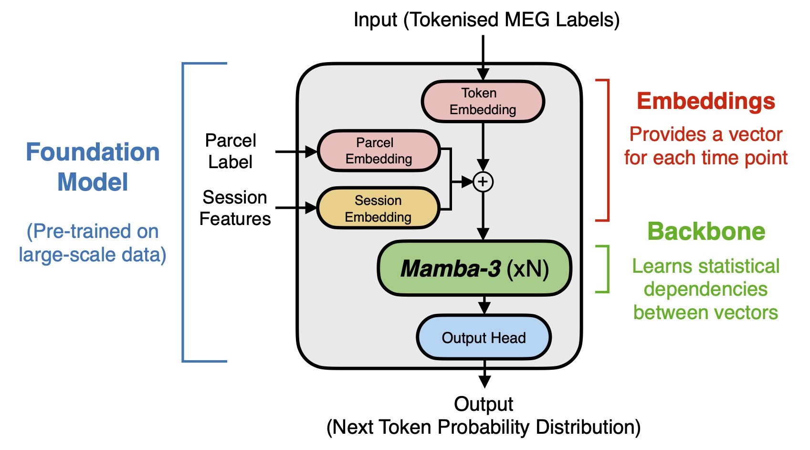

# MEG-Mamba

An autoregressive foundation model for tokenized, parcellated MEG.

## Architecture

<div align="center">
    
</div>

- **Mamba-3 (complex-valued SSM).**
- **Conditioning: channel embedding + feature-derived session embedding.** Two terms are added to the token embedding at the input: a learned per-parcel channel embedding and a session embedding produced by a small MLP from precomputed per-(session, parcel) token features (unigram + bigram-PCA).

See [model](model/) for hyperparameters and pretrained model weights.

## Setup

The core environment is `mamba3` (PyTorch 2.11/cu128, `mamba_ssm` @ `316ed60`):

```bash
bash envs/install_mamba3.sh
```

## Loading the model

The released model is `model/weights.pt` plus its architecture in `model/model_config.json`:

```python
import json, torch
from model import MEGMamba

config = json.load(open("model/model_config.json"))
model = MEGMamba(**config).eval()
model.load_state_dict(torch.load("model/weights.pt", map_location="cpu", weights_only=True))
```

`forward()` also needs a session-embedding feature table (a non-persistent buffer kept out of the checkpoint):

```python
model.set_session_features(torch.tensor(feat[None], dtype=torch.float32))  # (1, n_parcels, F)
```

## Calculating session features

For a session's tokens `(T, n_parcels)`, apply the released transform `data/session_feature_transform.npz`:

```python
import numpy as np
from compute_session_features import featurize_session

transform = np.load("data/session_feature_transform.npz")
feat = featurize_session(tokens, transform)   # (n_parcels, 292) float32
```

Pass `feat` to `model.set_session_features(...)`.

## Tokenizer

The model works on discrete tokens from the [EphysTokenizer](https://github.com/OHBA-analysis/EphysTokenizer) (causal variant): bundled in [tokenizer](tokenizer/).

## Data

The model is trained on [Cam-CAN](https://cam-can.mrc-cbu.cam.ac.uk/dataset/) resting-state only: 621 sessions, 75 hours at 250 Hz (~8 min/session; 559 train / 62 held out). The raw (MaxFiltered) MEG data was preprocessed, source reconstructed, and parcellated onto [Schaefer100](https://osl-dynamics.readthedocs.io/en/latest/parcellations/schaefer100.html) with [osl-dynamics](https://github.com/OHBA-analysis/osl-dynamics) (see [tutorial](https://osl-dynamics.readthedocs.io/en/latest/tutorials_build/0-2_meg_batch_processing.html)), then tokenized (see [tokenizer](tokenizer/)).

To reproduce this pipeline on your own recordings, follow [Preparing your own data](tokenizer/README.md#preparing-your-own-data).

> [!NOTE]
>
> **OHBA users.** To rebuild the manifest + session features from the corpus on BMRC (`fm_datasets/v1`):
> 
> ```bash
> conda activate mamba3
> 
> # 1. Select camcan/rest from the v1 manifest.csv (the corpus also holds passive/smt
> #    task sessions — excluded here) → data/manifest.pt (path + token length + index
> #    per session), and freeze the held-out split → data/holdout_sessions.json
> #    (62/621 sessions, seed 42).
> python prepare_data.py
> 
> # 2. Precompute the per-(session, parcel) token features the session-embedding MLP
> #    reads → data/session_features.npz.
> python compute_session_features.py
> ```

## Kernel constraints

Practical constraints for the Mamba-3 MIMO kernels (TileLang) on A100 (sm_80) and L4 (sm_89).

### Hardware

- Ampere+ required: The MIMO kernels run on A100 (sm_80) and L4 (sm_89).
- Needs nvcc >= 12.8 for the sm_89 JIT.

### Hard constraints

| Constraint | Value we use | Notes |
|---|---|---|
| seq_len % chunk_size == 0 | chunk_size=8 (MIMO), seq_len=1000 | non-MIMO uses 64 |
| mimo_rank >= 4 | 4 | valid ranks are 4/8/16 |
| (expand·d_model/headdim) % 4 == 0 | 2·256/64 = 8 | the "n_heads % 4" rule for the batched step kernel (generation, B>1); violating it mis-aligns state |
| headdim ∈ {32, 64, 128} | 64 | headdim=80 fails at compile (TileLang divide-by-zero) |
| A100 shared-mem ceiling 164 KB | — | mimo_rank=8 at chunk_size=8 exceeds it (needs H100 or chunk_size=4) |

## Project structure

```
model.py                     # MEGMamba
dataset.py                   # per-channel dataset + dataloaders
prepare_data.py              # build data/manifest.pt + holdout_sessions.json
compute_session_features.py  # build data/session_feature_transform.npz + feat table
train.py                     # single-GPU training (bf16 AMP, warmup→constant LR, resume)
generate.py                  # AR generation on held-out sessions
model/                       # released model: weights.pt + model_config.json + metrics.json + training_config.json
tokenizer/                   # bundled EphysTokenizer (causal)
data/                        # session_feature_transform.npz
slurm/                       # train.slurm, generate.slurm
envs/                        # install_mamba3.sh (mamba3)
```

## References

- Gu & Dao, "Mamba: Linear-Time Sequence Modeling with Selective State Spaces", 2023. [arXiv:2312.00752](https://arxiv.org/abs/2312.00752)
- Gu & Dao, "Mamba-3: Selective State Space Models with Complex-Valued State Updates", ICLR 2026. [arXiv:2603.15569](https://arxiv.org/abs/2603.15569)
